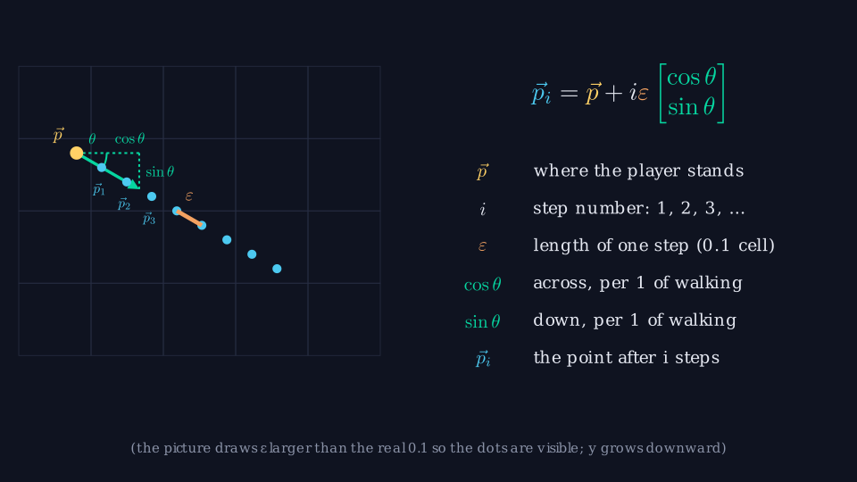
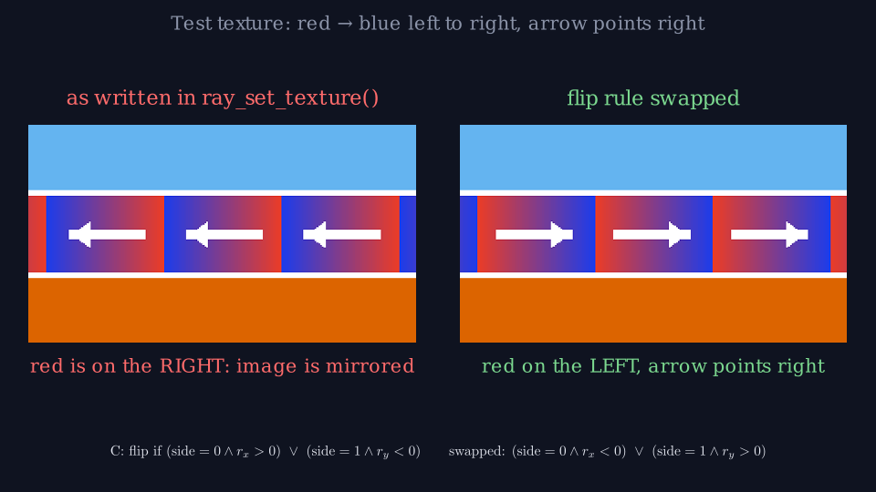
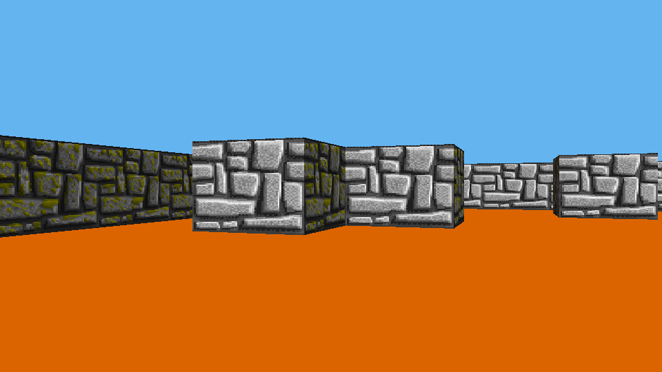

# How the Raycaster Works — a Linear-Algebra Walkthrough

This document explains how a raycaster works: the idea, and above all the math behind it. The running example is the raycaster in `../Raycaster`
(your `cub3D` project: a first-person maze view in the style of *Wolfenstein 3D*). We start from the obvious but too-slow way to draw a 3D room,
then build the vector and matrix tools that make it fast. The math comes first; the matching C code sits in short collapsible *In the code* boxes, so you can skip them.
Math is written as LaTeX (`$…$`, `$$…$$`; renders on GitHub, VS Code, Typora).
Every animation was produced with Manim (a Python library for maths animations) from a Python copy of the program's logic that is
cross-checked against the compiled C code, so the numbers in the animations are the numbers your program computes.

**Conventions used everywhere** (they match the C code, and they matter):

- The map is indexed `grid[y][x]`; **x grows to the right, y grows downward**. North is $(0,-1)$.
- A vector is a pair of numbers, written as a column $\begin{bmatrix}x\\y\end{bmatrix}$ or as $(x,y)$. Colours in every animation: <span style="color:#06d6a0">**d** direction</span>,
  <span style="color:#ef476f">**P** camera plane</span>, <span style="color:#4cc9f0">**r** ray</span>.
- **Every symbol and term is explained where it first appears**, and all of them are collected in
  [Notation and terms](#notation-and-terms-reference) below the contents table.
- C excerpts are lightly reformatted (line breaks collapsed) but otherwise copied from the source.
- The animations use a 12×8 demo room (not one of your `.cub` files) unless a caption says `maps/sample.cub`.

**The whole method in six steps.** For every screen column $x$: (1) turn the column into a ray $\vec r$ (§2); (2) walk the ray from grid line to
grid line until it enters a wall cell (§3); (3) read off how far ahead that wall is, its depth $z$ (§4); (4) turn $z$ into a wall height in
pixels (§5); (5) find which column of the wall's texture was hit (§6); (6) paint ceiling, wall strip and floor (§7). §8 moves the player and
§9 shows the complete loop. §0 explains why anyone would do it this way.

| Section | Idea |
|---|---|
| [Notation](#notation-and-terms-reference) | every symbol, notation and term, in one place |
| [0](#0-the-problem-computers-back-then-were-tiny) | Why the obvious way is too slow, and what we can do: which linear algebra fixes which problem |
| [1](#1-angles-per-column-and-what-still-goes-wrong) | One angle per column, and what still goes wrong: missed walls, fisheye |
| [2](#2-the-camera-is-a-matrix) | Camera = 2×2 matrix; rotation = left-multiplication; ray = matrix·vector |
| [3](#3-dda-walking-the-grid) | Ray = line; DDA merges two arithmetic sequences |
| [4](#4-perpendicular-distance-is-a-dot-product) | The fisheye fix: the perpendicular distance comes for free |
| [5](#5-projection-to-a-column) | Similar triangles → wall height on screen |
| [6](#6-texture-mapping) | Which column of the texture was hit, and which way it should run |
| [7](#7-drawing-a-column) | Colouring the column: ceiling, wall, floor, shading |
| [8](#8-the-player) | Movement as basis vectors, collision |
| [9](#9-one-frame-end-to-end) | The whole pipeline |

---

## Notation and terms (reference)

Each symbol and term is also explained where it first appears. This is the place to look one up later. A few symbols
($\vec d,\ \vec P,\ c,\ M$) are previewed in §0.2 before their proper explanation; the last column of the table names the section that explains each one.

### Symbols

| symbol | meaning | explained in |
|---|---|---|
| $W,\ H$ | screen width and height in pixels ($1280\times720$ here; the 1992 examples in §0 use $320\times200$) | §1, §2.2 |
| $x$ | which screen column: $0$ is the left edge, $W-1$ the right edge | §2.2 |
| $c$ | where that column sits across the screen, from $-1$ (left edge) to $+1$ (right edge): $c=\frac{2x}{W}-1$ | §2.2 |
| $\vec p$ | player position $(p_x,p_y)$, measured in cells | §0.1 |
| $\vec d$ | the direction the player faces, a vector of length 1 | §2.1 |
| $\vec P$ | the **camera plane**: a vector sideways to $\vec d$, length $0.66$, that sets how wide the player sees | §2.1 |
| $\vec r$ | the ray of one column: $\vec r=\vec d+c\vec P$ | §2.2 |
| $t$ | the **ray parameter**: how many copies of $\vec r$ you have walked. The point is $\vec q(t)=\vec p+t\vec r$ | §3.1 |
| $M$ | the camera matrix: $\vec d$ and $\vec P$ side by side | §2.2 |
| $J$ | the "quarter turn" matrix: $J\binom{x}{y}=\binom{-y}{x}$ | §2.1 |
| $R(\alpha)$ | the rotation matrix: turns a vector by angle $\alpha$ (§2.3 writes $R(\theta)$ for the same matrix with the angle $\theta$) | §2.3, §2.4 |
| $\theta$ | an angle: of one line (§0, §1), or the heading of $\vec d$ (§2.3) | §0.1 |
| $\alpha$ | how much the player turns in one frame, in radians | §2.4 |
| $\varepsilon$ | length of one step of the naive walk, in cells (for example $0.1$) | §0.1 |
| $i,\ k$ | counters. In §0.1 $i$ counts the steps; in §1 $i$ numbers the screen columns and $k$ counts the steps | §0.1, §1 |
| $\Delta t_x,\ \Delta t_y$ | how much $t$ grows between two neighbouring vertical (horizontal) grid lines | §3.1 |
| $\text{side\_dist}_x,\ \text{side\_dist}_y$ | the value of $t$ at the next vertical (horizontal) grid line the ray will reach | §3.2 |
| $\vec m=\lfloor\vec p\rfloor$ | the cell the ray is in: the whole-number $(x,y)$ | §3.2 |
| $\text{step}_x,\ \text{step}_y$ | which way the ray walks through the cells: $-1$ or $+1$ | §3.2 |
| $t_{\text{hit}}$ | the value of $t$ where the ray meets the wall | §4 |
| $a,\ b$ | "camera coordinates" of a world point: $a$ forward along $\vec d$, $b$ sideways along $\vec P$ | §2.5 |
| $z$ | the wall's depth: its distance straight ahead of the player. The same number as $D$ (§1), $a$ (§2.5) and $t_{\text{hit}}$ (§4) | §4, §5 |
| $\text{lh}$ | the wall's height on screen, in pixel rows | §5 |
| $\text{draw\_start},\ \text{draw\_end}$ | the first and last screen row of the wall in this column | §5 |
| $\text{wall\_x}$ | where along the wall face the ray hit: $0$ (one edge) to $1$ (other edge) | §6.1 |
| $\text{tex\_x}$ | which column of the texture image that is | §6.1 |
| $W_{\text{tex}},\ H_{\text{tex}}$ | texture width and height in pixels | §6.1 |
| $\text{dt}$ | seconds since the previous frame | §8.1 |
| $s$ | how far the player moves this frame: $s=\text{dt}\cdot\text{MOVE\_SPEED}$ | §8.1 |
| $\text{MOVE\_SPEED},\ \text{ROT\_SPEED}$ | settings: how fast the player walks ($3.0$ cells per second) and turns ($2.0$ radians per second) | §8.1 |

<details>
<summary>The same symbols as names in the C code</summary>

| symbol | name in the code |
|---|---|
| $W,\ H$ | `WIDTH` $=1280$, `HEIGHT` $=720$ |
| $x$ | loop variable `x` |
| $c$ | `camera_x` |
| $\vec p$ | `player.x`, `player.y` |
| $\vec d$ | `player.dir_x`, `player.dir_y` |
| $\vec P$ | `player.plane_x`, `player.plane_y`; `CAMERA_PLANE` $=0.66$ |
| $\vec r$ | `ray.dir_x`, `ray.dir_y` |
| $t$ | `side_dist` and `wall_dist` are values of $t$ |
| $M$ | (two vectors in the code, not a matrix object) |
| $R(\alpha)$, $\alpha$ | `player_rotate`, its argument `angle` |
| $\varepsilon$ | only in the obvious way of §0 and §1; not in the program |
| $\Delta t_x,\ \Delta t_y$ | `delta_dist_x`, `delta_dist_y` |
| $\text{side\_dist}_x,\ \text{side\_dist}_y$ | `side_dist_x`, `side_dist_y` |
| $\vec m$ | `map_x`, `map_y` |
| $\text{step}_x,\ \text{step}_y$ | `step_x`, `step_y` |
| $z$ | `wall_dist` |
| $\text{lh}$ | `line_height` |
| $\text{draw\_start},\ \text{draw\_end}$ | `draw_start`, `draw_end` |
| $\text{wall\_x}$ | `wall_x` |
| $\text{tex\_x}$ | `texture_x` |
| $W_{\text{tex}},\ H_{\text{tex}}$ | `texture->width`, `texture->height` |
| $\text{dt}$ | `delta_time` |
| $\text{MOVE\_SPEED},\ \text{ROT\_SPEED}$ | `MOVE_SPEED`, `ROT_SPEED` |

</details>

### Mathematical notation

| notation | read as | example |
|---|---|---|
| $\vec v$ | a **vector**: a pair of numbers $(x,y)$. The arrow on top marks it as a vector, not a single number | $\vec p=(2,4)$ |
| $\begin{bmatrix}x\\y\end{bmatrix}$ or $\binom{x}{y}$ | the same vector written as a column | |
| $\lvert\vec v\rvert$ | the **length** of a vector: $\sqrt{x^2+y^2}$ | $\lvert(3,4)\rvert=5$ |
| $\lvert a\rvert$ | absolute value: drop the minus sign | $\lvert-0.4\rvert=0.4$ |
| $a\cdot b$, $\sqrt a$ | between two numbers, $\cdot$ is ordinary multiplication (between two vectors it is the dot product, below). $\sqrt a$ is the square root: the number that multiplied by itself gives $a$ | $\sqrt2\approx1.414$ |
| $\lfloor a\rfloor$ | **floor**: round down to a whole number | $\lfloor 2.87\rfloor=2$, $\lfloor -0.5\rfloor=-1$ |
| $\lceil a\rceil$ | **ceiling**: round up | $\lceil 58.1\rceil=59$ |
| $\operatorname{frac}(u)$ | the part after the decimal point: $u-\lfloor u\rfloor$ | $\operatorname{frac}(2.87)=0.87$ |
| $\vec a\cdot\vec b$ | the **dot product**: $a_xb_x+a_yb_y$. It is $0$ exactly when the vectors are at a right angle | $(1,0)\cdot(0,1)=0$ |
| $A\vec v$ | a **matrix** times a vector: the matrix turns, stretches or mixes the vector. For $M=[\vec d\ \vec P]$: $M\binom{1}{c}=1\cdot\vec d+c\cdot\vec P$ | |
| $A^{-1}$ | the **inverse** matrix: undoes $A$, so $A^{-1}(A\vec v)=\vec v$ | |
| $A^{\mathsf T}$ | the **transpose**: swap rows and columns | |
| $I$ | the **identity** matrix: changes nothing | |
| $\det A$ | the **determinant**: the factor by which $A$ scales areas. A pure rotation has $\det=1$ | |
| $\operatorname{diag}(1,0.66)$ | the matrix with $1$ and $0.66$ on the diagonal and $0$ elsewhere: it keeps x and scales y by $0.66$ | |
| $\sin,\ \cos,\ \arctan$ | standard angle functions. $\cos\theta,\sin\theta$ give the "across" and "down" part of a length-1 step at angle $\theta$ (§0.1); $\arctan$ turns a ratio back into an angle | |
| radian (rad) | an angle unit: $180^\circ=\pi\approx3.14$ rad, so $1$ rad $\approx57.3^\circ$ | |
| $\leftarrow$ | "becomes": replace the left side with the right side | $\vec p\leftarrow\vec p+s\vec d$ |
| $\in[-1,1]$ | "lies between $-1$ and $1$" | |
| $\Delta$ | a gap or difference between two values | |
| $\approx$, $\pm$ | approximately equal; plus or minus | |

### Terms

| term | meaning |
|---|---|
| pixel, column | a pixel is one dot of the screen. A column is one vertical line of pixels, one pixel wide |
| cell, grid, map | the world is a flat 2D grid of square cells, each $1\times1$. A cell is `1` (wall) or `0` (empty); a letter `N`/`S`/`E`/`W` marks the player's start; a space counts as wall. All walls have the same height. `grid[y][x]` is row $y$, column $x$. Distances are in cells |
| ray | a line that starts at the player and goes on forever in one direction. The raycaster sends one per screen column |
| raycasting | building the picture by sending rays and seeing where each one hits a wall |
| unit vector | a vector of length 1 |
| perpendicular | at a right angle |
| camera plane | an imaginary window one unit in front of the player. $\vec P$ is half of it, from its middle to its right edge |
| basis | two vectors you can combine to reach any point: $\vec d$ and $\vec P$ are the camera's basis |
| linear | "equal change in, equal change out": if $c$ goes up by the same amount, $\vec r$ moves by the same amount |
| pinhole (perspective) camera | far things look smaller: a wall twice as far away looks half as tall |
| field of view (FOV) | the angle the player can see at once |
| Euclidean distance | the ordinary straight-line distance, measured along the ray |
| perpendicular distance, depth | distance measured straight ahead (along $\vec d$), not along the slanted ray |
| fisheye | the bending of straight walls you get if you use the Euclidean distance for wall height |
| perspective divide | dividing by depth to shrink far things: $c=b/a$ (§2.5) |
| DDA | "digital differential analyzer": the method that walks a line from one grid line to the next (§3) |
| arithmetic sequence | numbers with a constant gap, such as $0.5,\,1.5,\,2.5,\dots$ |
| similar triangles | triangles with the same shape, so their sides are in proportion (§5) |
| orthogonal matrix | a matrix that turns without stretching: it keeps lengths and angles (§2.4) |
| texture, texel | a picture pasted on a wall; a texel is one pixel of that picture |
| framebuffer | the block of memory holding the colour of every pixel of the next picture (§7) |
| RGBA, channel | a colour as red, green, blue and alpha (opacity), each channel $0$ to $255$ |
| clamp | limit a number to a range: values below the range become its lowest value, above it its highest |
| normalised | scaled to length 1 |
| strafe | move sideways without turning |
| frame | one finished picture |

---

## 0. The problem: computers back then were tiny

Raycasting exists because the obvious way of drawing a 3D room was far too slow for the computers of 1992. This
section shows the obvious way, why it was too slow, and what we can do about it, with the linear algebra that helps. The rest
of the document explains each part in turn.

### 0.1 The obvious way

*Wolfenstein 3D* (1992) drew into a $320\times200$ screen, which is $64{,}000$ pixels. The world is a room with walls in it,
and the player looks into it. Distances are measured in **cells**: one cell is the width of one wall. The obvious way to
draw it is to give **every pixel its own ray**: ask each pixel "what wall do you see?":

1. Point a line (a *ray*) from the player through that pixel, at some angle $\theta$ (theta).
2. Walk along it in small steps of length $\varepsilon$ (epsilon, say $0.1$ cell). After $i$ steps the point is at

$$\vec p_i=\vec p+i\,\varepsilon\begin{bmatrix}\cos\theta\\ \sin\theta\end{bmatrix}$$

3. After each step ask: *is this point inside a wall?* The first "yes" is the wall, and its distance decides how the pixel
   is coloured.



In words: $\vec p$ is where the player stands, $i$ counts the steps, $\varepsilon$ is the length of one step, and
$(\cos\theta,\ \sin\theta)$ is a direction of length 1 (`cos` and `sin` give its "across" and "down" parts, the dashed
triangle in the picture). Each step just adds the same small arrow, so it costs two additions, one for $x$ and one for $y$.
(The picture is drawn flat to keep the formula short. A ray through a pixel of a real 3D room also has an up/down part, a third
addition per step, so the counts below are, if anything, too low.)


Count the work for one picture. In the demo room used for the animations a wall is on average $5.8$ cells away, which is
$\lceil5.81/0.1\rceil=59$ steps ($\lceil\,\rceil$ rounds **up**). So

$$64{,}000\ \text{lines}\times59\ \text{steps}\times2\ \text{additions}\;\approx\;\mathbf{7.6\ million\ additions},$$

plus one `sin`/`cos` pair per line. These numbers have fractions (3.7, 4.25), which a computer stores as
**floating-point** ("decimal") numbers. The computers of 1992 could not do this fast enough: a 386 would need about
**6 seconds** for one picture, and the game needed 70 pictures every second, one every 14 ms.

### 0.2 What can we do?

Three things made the obvious way slow: **too many lines**, **`sin` and `cos` for every line**, and **too many tiny steps along
each line**. Each one can be attacked, and the tool that does it is mostly
**linear algebra**: vectors, one small matrix and the dot product. Here is each problem, what we can do, which linear
algebra helps, and the section that explains it.

**1. Too many lines** (64,000 per picture)

- *What we can do:* **simplify the world on purpose.** In a real 3D world every pixel could see something different, which is why
  the obvious way needs a ray per pixel. So we restrict the world:
  - the map is only **2D**: a flat grid of square cells, each $1\times1$, and every cell is `0` (empty floor) or `1` (wall), plus
    one letter (`N`, `S`, `E` or `W`) that marks where the player starts and which way they face. This is the map from your
    `maps/sample.cub`:

    ```
    1111111111
    1000000001
    1000N00001
    1000000001
    1111111111
    ```

    (To find which cell a point $(x,y)$ is in, round both numbers **down**: $\lfloor2.87\rfloor=2$.)
  - every wall stands **straight up** and has **exactly the same height**; floor and ceiling are flat colours;
  - the player only **turns left and right** (no looking up or down) and stays at one height.

  Under these rules a whole screen column shows **one vertical strip of one wall at one distance**, so a single ray tells us
  everything about that column. Cast **one line per column**: at $320\times200$ that is 320 lines instead of
  64,000, which is 200× fewer (6 s becomes about 30 ms). The price: no slopes, stairs, different wall heights or rooms above
  rooms.
- *Linear algebra:* because the map is 2D, everything lives in the plane, so a point is a pair of numbers and a direction is a
  2-vector. A column becomes **one number** $c$ between $-1$ and $1$, and its line is the vector $\vec r=\vec d+c\,\vec P$, a
  combination of two vectors: the direction the player faces and the camera plane.
- *Explained in:* [§1](#1-angles-per-column-and-what-still-goes-wrong) (one angle per column),
  [§2.1–2.2](#21-two-vectors-define-the-camera).

**2. `sin` and `cos` for every line**

- *What we can do:* describe each line with a **vector** (two numbers) instead of an angle, so no trigonometry is needed per
  line.
- *Linear algebra:* put $\vec d$ and $\vec P$ side by side as a **matrix** $M$. Then $\vec r=M\binom{1}{c}$, a matrix times a
  vector. Turning the player is one **matrix product**, $M\leftarrow R(\alpha)M$, so `sin` and `cos` run once per turn instead of
  once per line. Going the other way (world point to screen) is the **inverse matrix** $M^{-1}$.
- *Explained in:* [§2.2](#22-a-screen-column-is-a-coordinate), [§2.3–2.4](#23-the-camera-matrix-is-rotation--scale),
  [§2.5](#25-raycasting-is-the-inverse-of-perspective-projection).

**3. About 59 tiny steps per line**

- *What we can do:* a line only matters where it crosses a cell border. **Jump from grid line to grid line** (DDA): about 8
  jumps instead of 59, and no wall can be skipped.
- *Linear algebra:* a line is $\vec q(t)=\vec p+t\,\vec r$, a point plus a multiple of a vector. Solving for where it meets the
  grid lines gives the gap between crossings, $\Delta t_x=1/\lvert r_x\rvert$ (and the same for $y$): two evenly spaced lists
  of numbers that we merge in order.
- *Explained in:* [§3](#3-dda-walking-the-grid).

The same tools finish the picture: the distance to the wall is a dot product ([§4](#4-perpendicular-distance-is-a-dot-product)),
the wall's height on screen follows from it ([§5](#5-projection-to-a-column)), the hit point $\vec p+t\,\vec r$ gives the texture column
([§6](#6-texture-mapping)), the column is drawn ([§7](#7-drawing-a-column)), moving the player is a combination of the basis
vectors $\vec d$ and $J\vec d$ ([§8](#8-the-player)), and [§9](#9-one-frame-end-to-end) puts the whole frame together.

Together the three fixes bring one picture to about **8.5 ms** on the same 386, inside the 14 ms allowed.

<details>
<summary>How these numbers were estimated (assumptions and sources)</summary>

A *tick* is one beat of the processor's clock (a 33 MHz chip has 33 million per second); a whole-number addition takes 2 of them, a
decimal addition 24, a decimal division 88, and `sin` with `cos` 194. Only the arithmetic is counted, with the *lowest* published tick count of each instruction, so real costs are higher. Ray
counts (5.81 cells, 59 steps, 7.6 DDA steps) come from the 320 real rays of the demo room run through the Python mirror of
the C code; the tick prices are estimates. `python common/budget.py` prints every number.

- **Obvious way:** setup = `FSINCOS` 194 + 2 `FMUL` 54 = 248 ticks per line; each step = 2 `FADD` = 48 ticks
  (`FADD`/`FMUL`/`FDIV` are the maths chip's decimal add, multiply, divide).
- **This project, one line per column:** about 878 ticks per column (380 set up the ray, 227 for 7.6 DDA steps, 112 for
  distance and wall height, 158 to draw 39.6 pixels). Times 320 columns is 281,000 ticks, which is 8.5 ms.
- **Not a profile of the real game.** *Decimal* instructions are priced to match this project's C code (which uses `double`).
  The shipped game used whole-number (fixed-point) maths and its own variant of the algorithm. Read the numbers as "why the
  obvious method was hopeless".
- **Today** (1280×720, 60 pictures per second, a 3 GHz core) there are about 54 ticks per pixel, so per-pixel rays became
  feasible (GPUs do them). The ratio between the methods is unchanged: 720× fewer lines with one per column.

**Sources.**
[Wolfenstein 3D (Wikipedia)](https://en.wikipedia.org/wiki/Wolfenstein_3D) ·
[Mode 13h (Wikipedia)](https://en.wikipedia.org/wiki/Mode_13h) (320×200, 64,000 bytes) ·
[tech specs](https://www.pixelatedarcade.com/games/wolfenstein-3d/techspecs) ·
Fabien Sanglard, [*Game Engine Black Book: Wolfenstein 3D*](https://fabiensanglard.net/Game_Engine_Black_Book/index.php)
(ch. 2.1.1 target CPU, 2.1.3 instruction costs, 2.3.7 the 70 pictures per second) ·
[Intel i387 datasheet](https://www.ardent-tool.com/CPU/docs/Intel/387/datasheets/271074-006.pdf) ·
[Lo-tech wiki, 80x87](https://www.lo-tech.co.uk/wiki/80x87_Math_Coprocessors) (`FDIV`) ·
Lode Vandevenne's [Raycasting tutorial](https://lodev.org/cgtutor/raycasting.html) (source of the DDA variant used here).

</details>

---

## 1. Angles per column, and what still goes wrong

With one ray per column ([§0.2](#02-what-can-we-do)), the angle method gives each column its own angle and walks along it exactly as in
[§0.1](#01-the-obvious-way):

$$\theta_i=\theta_p+\Big(\tfrac{i}{W}-\tfrac12\Big)\text{FOV},\qquad
\vec p_k=\vec p+k\,\varepsilon\begin{bmatrix}\cos\theta_i\\ \sin\theta_i\end{bmatrix},\quad k=1,2,\dots$$

stop at the first $\vec p_k$ inside a wall cell. Here $\theta_p$ is the direction the player faces, FOV (field of view) is the total angle the player sees, $W$ is the screen width in pixels and $i$ is the column number, so the columns share the field of view equally, one angle per column. $\theta_i$ is the angle of column $i$. (The steps are numbered $k$ here because $i$ numbers the screen columns.)

The cost of this method (a `sin`/`cos` pair per ray and many tiny steps) was counted in §0.1 (there for every pixel, here for 200× fewer rays). Two other problems remain:

1. **Missed walls.** With a large $\varepsilon$ a ray can step right over a wall (a wall is only one cell thick) or slip through the corner where two walls touch.
2. **Fisheye.** Think of the screen as a flat window. How tall a wall looks in that window depends on how far the wall is *straight ahead of you*, its
   **depth** $D$, not on the length of the slanted ray that reaches it. (Stand in front of a long flat wall: its far ends are farther from your eye than its middle,
   yet a photograph shows straight, evenly tall edges.) The angle method measures the *Euclidean* distance $d$, the straight-line length along the ray
   (this plain $d$ is a length and has nothing to do with the direction vector $\vec d$ of §2). A ray at angle $\theta$ from the view direction is longer than the depth
   to the same flat wall: $d=D/\cos\theta$. So using $d$ makes the edges look too far away and too short, and the flat wall bows. Undoing it needs
   $D=d\cos\theta$: one more trig call per ray.


In the picture, the green line is the depth $D$: it goes straight ahead, meets the wall at a right angle, and is the same for the whole flat wall. The blue slanted line is the
Euclidean distance $d$ along a ray, and $\theta$ (yellow) is the angle between them. As the ray turns toward the edge of the view, $\theta$ grows and
$d=D/\cos\theta$ grows with it, even though the wall is flat, so a wall height computed from $d$ shrinks at the edges. The red line is the **camera plane**,
the flat window we look through (built in [§2](#2-the-camera-is-a-matrix)): it sits one unit in front of the player, at a right angle to the green line, and its two vectors are $\vec d$ (green arrow) and $\vec P$ (red arrow).

**The idea of the fix:** measure each ray's distance *perpendicular to the camera plane* (that is, straight ahead along the view direction) instead of along
the ray. We will build the rays from vectors (§2) so that this perpendicular distance comes out of the walk for free, with no angle and no $\cos$ (§4).
The same vector view also removes the per-ray trigonometry (§2) and lets us walk the grid exactly (§3).

---

## 2. The camera is a matrix

### 2.1 Two vectors define the camera

The player has a position $\vec p$, a **unit** direction $\vec d$ (a vector
of length 1 pointing where the player faces) and a **camera plane** $\vec P$, **perpendicular** (at a right angle) to $\vec d$,
with length $0.66$ (a constant chosen by the programmer). Think of the camera plane as an imaginary window one unit in front of the player:
$\vec P$ goes from the middle of the window to its right edge, so a longer $\vec P$ means a wider view.

$$\vec P = 0.66\,J\vec d,\qquad J=\begin{bmatrix}0&-1\\1&0\end{bmatrix}\;(\text{rotation by }90^\circ),\qquad J\begin{bmatrix}x\\y\end{bmatrix}=\begin{bmatrix}-y\\x\end{bmatrix}.$$

$J$ is a matrix (a table of numbers that turns one vector into another: each row is multiplied against $(x,y)$ and added).
This one turns any vector a quarter turn, so $J\vec d$ is perpendicular to $\vec d$ and has the same length. On the screen ($y$ points down) this
quarter turn is clockwise: north becomes east, so $\vec P$ points to the player's right.

Example: facing north,
$\vec d=\begin{bmatrix}0\\-1\end{bmatrix}$ and $\vec P=\begin{bmatrix}0.66\\0\end{bmatrix}$.

<details>
<summary>In the code: <code>player_init</code> (<code>src/player/player_init.c</code>)</summary>

```c
plane_x = -dir_y * CAMERA_PLANE;
plane_y =  dir_x * CAMERA_PLANE;
```

</details>


### 2.2 A screen column is a coordinate

Column $x$ of a screen $W$ pixels wide ($W=1280$ here; $x=0$ is the left edge) gets the coordinate $c=\frac{2x}{W}-1\in[-1,1]$:
$-1$ at the left edge, $0$ in the middle, and just under $+1$ at the right edge (the last column, $x=W-1$, gets $1-\frac2W$). Its ray is

$$\vec r \;=\; \vec d + c\,\vec P \;=\; \underbrace{\begin{bmatrix}\vec d&\vec P\end{bmatrix}}_{M}\begin{bmatrix}1\\c\end{bmatrix}.$$

The last step is a matrix times a vector: $M\binom{1}{c}=1\cdot\vec d+c\cdot\vec P$. Here $M$ is the matrix whose two columns are $\vec d$ and
$\vec P$. In words: the ray is one step forward plus $c$ steps sideways.

*Why a matrix?* Read a matrix column by column: the first column is where the vector $(1,0)$ lands, the second column is where $(0,1)$ lands.
$M$ sends $(1,0)$ to $\vec d$ and $(0,1)$ to $\vec P$, so it sends $(1,c)=1\cdot(1,0)+c\cdot(0,1)$ to $1\cdot\vec d+c\cdot\vec P$.
The pair $(1,c)$ is the ray in the camera's own picture ("1 forward, $c$ sideways"), and $M$ carries that picture into the map.
A whole ray costs a few multiplications and additions.

<details>
<summary>In the code: <code>ray_init</code> (<code>src/render/ray_init.c</code>)</summary>

```c
ray->camera_x = 2.0 * x / (double)WIDTH - 1.0;
ray->dir_x = game->player.dir_x + game->player.plane_x * ray->camera_x;
ray->dir_y = game->player.dir_y + game->player.plane_y * ray->camera_x;
```

</details>


Three facts come for free from the matrix view:

- **Equal spacing on the plane.** $\vec r$ is *linear* in $c$ (an equal change in $c$ moves $\vec r$ by an equal amount), so the
  columns sample the camera plane at equal steps. That is exactly a perspective (*pinhole*) projection, the way a camera sees
  (far things smaller); equal steps in *angle* would not be (§1).
- **Field of view.** $\text{FOV}=2\arctan\dfrac{|\vec P|}{|\vec d|}=2\arctan 0.66\approx 66.8^\circ$
  ($|\vec v|$ is a vector's length; $\arctan$ turns the ratio 0.66 back into an angle, about $33.4^\circ$ to each side).
  A longer plane widens it (animation), which is the same as zooming out.
- **No trig.** Building a ray needs no sine or cosine, only a multiplication and an addition for each coordinate.

### 2.3 The camera matrix is rotation × scale

Write $\theta$ for the heading of $\vec d$ (its angle from the x axis) and $R(\theta)$ for the 2-D **rotation matrix**, which turns a
vector by $\theta$. Reading it by columns again: turning by $\theta$ sends $(1,0)$ to $(\cos\theta,\sin\theta)$ and $(0,1)$ to $(-\sin\theta,\cos\theta)$,
and those two results are exactly its two columns:

$$R(\theta)=\begin{bmatrix}\cos\theta&-\sin\theta\\ \sin\theta&\cos\theta\end{bmatrix}.$$

Then

$$M=\begin{bmatrix}\vec d&\vec P\end{bmatrix}=R(\theta)\begin{bmatrix}1&0\\0&0.66\end{bmatrix},\qquad \det M = 0.66 .$$

The second matrix is $\operatorname{diag}(1,0.66)$: it keeps the x part and shrinks the y part to $0.66$. $\det M$, the
*determinant*, is the factor by which $M$ scales areas: a rotation keeps areas, the shrink by $0.66$ scales them by $0.66$.

Check for north ($\theta=-90^\circ$): $R(-90^\circ)\,\text{diag}(1,0.66)=\begin{bmatrix}0&0.66\\-1&0\end{bmatrix}$, which is
the matrix $[\vec d\ \vec P]$ above. In the camera's own frame the ray is simply $\begin{bmatrix}1\\0.66\,c\end{bmatrix}$:
one unit forward, $0.66c$ sideways. The matrix $R(\theta)$ only carries that picture into the world.

### 2.4 Turning the player is one matrix product

Turning the player by an angle $\alpha$ means turning **both columns** of $M$ (both $\vec d$ and $\vec P$) with the same rotation:

$$M'=R(\alpha)\,M,\qquad R(\alpha)=\begin{bmatrix}\cos\alpha&-\sin\alpha\\ \sin\alpha&\cos\alpha\end{bmatrix}$$

($\alpha$ is the angle turned this frame, in *radians*: $180^\circ=\pi\approx3.14$ rad, so $0.5$ rad is about $29^\circ$. $M'$ is the new camera matrix.)

<details>
<summary>In the code: <code>player_rotate</code> (<code>src/player/player_rotate.c</code>)</summary>

```c
game->player.dir_x   = old_dir_x   * cosine - game->player.dir_y   * sine;
game->player.dir_y   = old_dir_x   * sine   + game->player.dir_y   * cosine;
game->player.plane_x = old_plane_x * cosine - game->player.plane_y * sine;
game->player.plane_y = old_plane_x * sine   + game->player.plane_y * cosine;
```

</details>


Because $R$ is **orthogonal** it turns vectors without stretching them. In symbols $R^{\mathsf T}R=I$: the *transpose* $R^{\mathsf T}$ is
$R$ with rows and columns swapped, and $I$ is the *identity* matrix (it changes nothing), so $R^{\mathsf T}$ undoes $R$. That is exactly what keeps
lengths and angles unchanged. Also $\det R=1$, so areas are kept and nothing is flipped. The result: after any turn $|\vec d|=1$, $|\vec P|=0.66$ and
$\vec d\cdot\vec P=0$ still hold. (The *dot product* $\vec a\cdot\vec b=a_xb_x+a_yb_y$ is $0$ exactly when the two vectors are at a
right angle.) Example, $\alpha=0.5$ from north:

$$R(0.5)\begin{bmatrix}0&0.66\\-1&0\end{bmatrix}=\begin{bmatrix}0.4794&0.5792\\-0.8776&0.3164\end{bmatrix},$$

which is what the program computes (`player_rotate`). The only trig anywhere is the one sine and one cosine of $\alpha$ per turn, not one per ray:
we rotate $\vec d$ and $\vec P$ once, then reuse them for all $W$ rays.

With $y$ pointing down, a positive $\alpha$ turns **clockwise on screen** (north $(0,-1)$ becomes $(\sin\alpha,-\cos\alpha)$,
which points east for small $\alpha$): right arrow = positive angle = turn right.

### 2.5 Raycasting is the inverse of perspective projection

**Projection** is what a camera does: given a world point $\vec q$, where does it land on the screen? First express it in camera coordinates: $a$ is how far
forward it is (along $\vec d$) and $b$ how far sideways (along $\vec P$). For that we need the *inverse* matrix $M^{-1}$, which undoes $M$:

$$\begin{bmatrix}a\\b\end{bmatrix}=M^{-1}(\vec q-\vec p),\qquad c=\frac{b}{a}\quad(\text{perspective divide}),\qquad x=\frac{W}{2}(1+c).$$

The *perspective divide* $c=b/a$ is what makes far things smaller: the same sideways offset $b$ is divided by a bigger depth $a$.
The last formula turns $c\in[-1,1]$ back into a pixel column.

Example: $\vec p=(4.5,2.5)$ facing north, $\vec q=(5.5,0.5)$. With $M=\begin{bmatrix}0&0.66\\-1&0\end{bmatrix}$,
$M^{-1}=\begin{bmatrix}0&-1\\1.515&0\end{bmatrix}$, so $(a,b)=(2,\,1.515)$, $c=0.7576$, pixel $x\approx1125$. Casting the ray
for that column gives $\vec r=\vec d+c\vec P=(0.5,-1)$ and $\vec p+2\vec r=(5.5,0.5)=\vec q$. ✓ (verified numerically.)

The raycaster runs this **backwards**: for each column it starts from $c$, builds $\vec r=M\binom{1}{c}$, and searches the
grid for the point where the ray arrives. Walking $t$ copies of $\vec r$ lands at $\vec q=\vec p+t\vec r=\vec p+t\,\vec d+tc\,\vec P$, so in camera
coordinates $a=t$ and $b=tc$ (which gives $c=b/a$ again). In particular **the depth $a$ of the hit is exactly the ray parameter $t$**. Intuitively, $\vec r=\vec d+c\vec P$ always contains "one unit forward",
so each copy of $\vec r$ moves you exactly one unit forward, whatever the column. §4 turns this into the fisheye fix.

---

## 3. DDA: walking the grid

### 3.1 A ray is a line, and grid lines are at integers

$$\vec q(t)=\vec p+t\,\vec r,\qquad t\ge 0.$$

$\vec q(t)$ is the point you reach after walking $t$ copies of $\vec r$ from the player; $t$ is the **ray parameter**, and $t=0$ is the
player. The grid lines are the lines $x=k$ and $y=k$ for whole numbers $k$ (the borders of the cells). $p_x,\,r_x$ are the x parts of
$\vec p,\,\vec r$. The ray crosses a vertical grid line $x=k$ when $p_x+t\,r_x=k$, i.e. at $t=\dfrac{k-p_x}{r_x}$. Consecutive
vertical lines are hit at parameters that differ by

$$\Delta t_x=\frac1{|r_x|},\qquad \Delta t_y=\frac1{|r_y|}.$$

($\Delta$ means "the gap between two neighbours"; $|r_x|$ is $r_x$ without its minus sign.) Geometrically: moving by
$\Delta t_x\,\vec r$ changes $x$ by exactly 1. (Example: if $r_x=0.5$, one copy of $\vec r$ moves only half a cell in $x$, so it takes $\Delta t_x=2$ copies to cross one cell.) The crossings of the vertical lines form an *arithmetic sequence* in $t$ (numbers
with a constant gap, like $0.5,\,1.5,\,2.5,\dots$), and so do the crossings of the horizontal lines.


(If $r_x=0$ the ray runs parallel to the vertical lines and never crosses one, so $\Delta t_x$ is treated as infinitely large.)

<details>
<summary>In the code: <code>ray_init</code> (<code>src/render/ray_init.c</code>)</summary>

```c
ray->delta_dist_x = 1e30;              /* r_x == 0: the ray never crosses a vertical line */
if (ray->dir_x != 0)
    ray->delta_dist_x = fabs(1.0 / ray->dir_x);
```

</details>

### 3.2 The first crossings

Starting at the cell $\vec m=\lfloor\vec p\rfloor$ (the player's position rounded down), the first crossing of each family
of lines is the part of a cell still ahead, times $\Delta t$:

$$\text{side\_dist}_x=\begin{cases}(p_x-m_x)\,\Delta t_x & r_x<0\\ (m_x+1-p_x)\,\Delta t_x & r_x\ge0\end{cases}$$

(and the same for $y$), with $\text{step}_x=-1$ if the ray goes left ($r_x<0$) and $+1$ otherwise. Reading the cases: going right, the part of the cell still ahead is $m_x+1-p_x$ cells, and each cell costs $\Delta t_x$ of ray parameter,
so the first crossing is at $(m_x+1-p_x)\,\Delta t_x$; going left, the part ahead is $p_x-m_x$ cells.

<details>
<summary>In the code: <code>ray_set_x_distance</code> (<code>src/render/ray_init.c</code>)</summary>

```c
if (ray->dir_x < 0) { ray->step_x = -1; ray->side_dist_x = (game->player.x - ray->map_x) * ray->delta_dist_x; }
else                { ray->step_x =  1; ray->side_dist_x = (ray->map_x + 1.0 - game->player.x) * ray->delta_dist_x; }
```

</details>

### 3.3 The loop merges two sorted lists

We have two increasing sequences, $\text{side\_dist}_x+k\,\Delta t_x$ and $\text{side\_dist}_y+k\,\Delta t_y$ ($k=0,1,2,\dots$). Walking the
grid means visiting their union **in order**: always advance whichever comes next. That is the whole algorithm, called **DDA**
(digital differential analyzer, the name of this kind of line-walking method). `side` records which kind of line was just
crossed: $0$ = a vertical line (the ray moved in x), $1$ = a horizontal line (it moved in y). In plain steps, repeat until a wall is hit:

1. Compare $\text{side\_dist}_x$ and $\text{side\_dist}_y$. The smaller one is the next grid line the ray reaches.
2. Step into the next cell across that line ($\text{step}_x$ or $\text{step}_y$), set `side`, and add that axis's $\Delta t$ to its $\text{side\_dist}$ so it now points at the following line of the same family.
3. If the new cell is a wall, stop.

<details>
<summary>In the code: <code>ray_dda</code> (<code>src/render/ray_dda.c</code>)</summary>

```c
while (!ray->hit)
{
    if (ray->side_dist_x < ray->side_dist_y) { ray->side_dist_x += ray->delta_dist_x; ray->map_x += ray->step_x; ray->side = 0; }
    else                                     { ray->side_dist_y += ray->delta_dist_y; ray->map_y += ray->step_y; ray->side = 1; }
    if (map_is_wall(game, ray->map_x, ray->map_y))
        ray->hit = 1;
}
```

</details>


Real trace for column $x=1040$ of the demo room (player at $(2.5,4.5)$ facing east; $c=0.625$, so $\vec r=(1,\,0.4125)$,
$\Delta t_x=1.00$, $\Delta t_y=2.42$):

| iter | side_dist_x | side_dist_y | smaller → step | cell entered |
|---:|---:|---:|:--:|:--:|
| 1 | 0.500 | 1.212 | x | (3,4) |
| 2 | 1.500 | 1.212 | y | (3,5) |
| 3 | 1.500 | 3.636 | x | (4,5) |
| 4 | 2.500 | 3.636 | x | (5,5) |
| 5 | 3.500 | 3.636 | x | (6,5) |
| 6 | 4.500 | 3.636 | y | (6,6) |
| 7 | 4.500 | 6.061 | x | (7,6) |
| 8 | 5.500 | 6.061 | x | (8,6) |
| 9 | 6.500 | 6.061 | y | **(8,7) wall** |

(values are those *before* each step; ties go to $y$ because $x$ is chosen only when it is strictly smaller.) Nine iterations instead of about 60 fixed steps of $\varepsilon=0.1$, no
trig, and no wall can be skipped, because every cell the ray passes through is visited. The last step was a $y$-step, so $\text{side}=1$, and
$\text{side\_dist}_y$ was then advanced once more, to $6.061+2.424=8.485$; §4 subtracts that last $\Delta t_y$ again to get the hit at $t=6.061$.

The number of iterations is exactly $|\Delta m_x|+|\Delta m_y|$, because every iteration moves the ray into one new cell ($\Delta m_x$ and $\Delta m_y$ are
how many cells the ray moves in x and in y between the player's cell and the wall's cell; in the trace above, $6+3=9$). Over a whole
frame on `maps/sample.cub` (player at spawn, 1280 rays), counted with the same Python mirror:


| method | steps per frame (1280 rays) |
|---|---:|
| fixed step $\varepsilon=0.01$ | 205,830 |
| fixed step $\varepsilon=0.05$ | 41,766 |
| DDA (this project) | **3,193** |

That is 64× fewer than $\varepsilon=0.01$, with exact cell boundaries and 0 trig calls per ray. (Counts are for this small
map. In a bigger room both methods need proportionally more steps, so the ratio stays about the same; what changes the ratio is $\varepsilon$: DDA does not depend on it, while fixed stepping costs more the smaller $\varepsilon$ is.)

Cells outside the map and blank cells count as walls, so the walk always ends.

---

## 4. Perpendicular distance is a dot product

### 4.1 What distance do we need?

The walk gives us the ray parameter of the wall, $t_{\text{hit}}$. When the loop ends, the last step crossed the wall's edge and then added one more
$\Delta t$ to that axis's $\text{side\_dist}$, so $\text{side\_dist}$ already points to the next crossing beyond it. Take the axis of the last step
(`side` $=0$: the x values, `side` $=1$: the y values) and step back one $\Delta t$:

$$t_{\text{hit}}=\text{side\_dist}-\Delta t .$$

In the §3 trace this is $t_{\text{hit}}=8.485-2.424=6.06$. The straight-line (Euclidean) distance from the player to the wall is $t_{\text{hit}}\,|\vec r|$:
the length of one copy of $\vec r$ times the number of copies we walked. But §1 showed that this is *not* the distance we want. We want the wall's
**depth**: how far ahead it is, measured along the view direction $\vec d$, that is, perpendicular to the camera plane.

### 4.2 The idea: every ray moves exactly one unit forward per step

Look at one ray $\vec r=\vec d+c\vec P$. Its forward part is $\vec d$, which has length 1. Its sideways part $c\vec P$ lies along the camera plane, at a right angle to
$\vec d$, so it adds *nothing* to "how far forward". Therefore **every ray, whatever its column, moves exactly one unit forward per copy of $\vec r$.**
Said another way: every ray passes through the camera plane, the plane is one unit ahead, so one copy of $\vec r$ reaches the plane and $t$ copies
reach depth $t$. The ray parameter is already the perpendicular distance, and the fisheye never appears.

### 4.3 The same thing with a dot product

The dot product $\vec d\cdot\vec v$ measures how much of $\vec v$ points along $\vec d$. Because $|\vec d|=1$, it is exactly the forward part of $\vec v$
(the length of the "shadow" of $\vec v$ on $\vec d$). Apply it to the point we reach after $t$ copies of $\vec r$:

$$\vec d\cdot(t\,\vec r)=t\,\big(\vec d\cdot\vec d+c\,\vec d\cdot\vec P\big)=t\,(1+c\cdot 0)=t .$$

Here $\vec d\cdot\vec d=|\vec d|^2=1$ and $\vec d\cdot\vec P=0$ (they are perpendicular), so $\vec d\cdot\vec r=1$ for **every** column. The depth is exactly
$t_{\text{hit}}$: no correction, no angle, no $\cos$. That is the whole fisheye fix.

<details>
<summary>In the code: the first lines of <code>ray_project</code> (<code>src/render/ray_projection.c</code>)</summary>

```c
if (ray->side == 0) ray->wall_dist = ray->side_dist_x - ray->delta_dist_x;
else                ray->wall_dist = ray->side_dist_y - ray->delta_dist_y;
```

</details>

A word on "perpendicular to the plane": the depth is measured from the player's eye, not from the camera plane itself. The plane is one unit ahead of the eye,
so the distance from the plane to the wall would be $t_{\text{hit}}-1$. We need the distance from the eye because the similar triangles of §5 have the eye as their tip.

This one number has gone by several names: $D$ (§1), $a$ (§2.5), $t_{\text{hit}}$ (here), $z$ (§5), and `wall_dist` in the code.

### 4.4 Check against the angle picture

It agrees with §1 (here $\theta$ is the angle between the ray and $\vec d$): $|\vec r|=\sqrt{1+(0.66c)^2}=1/\cos\theta$, so
$\text{Euclid}=t|\vec r|=t/\cos\theta$ and $\text{perp}=\text{Euclid}\cdot\cos\theta=t$ (checked numerically, e.g. at $c\approx0.531$: $|\vec r|=1.0597$,
$1/|\vec r|=0.94367=\cos\theta$). The $\cos\theta$ that §1 wanted to apply to every ray is already hidden in the length of $\vec r$.


---

## 5. Projection to a column

Put the view plane (the imaginary window) at depth 1. A wall of height 1 at depth $z$ (the depth from §4, so $z=t_{\text{hit}}$) is, by *similar triangles* (triangles of the same shape, so their sides are in proportion), $1/z$ tall on that plane:
twice as far means half as tall. Now choose the scale so that height $1$ on the plane is $H$ pixels; a wall at $z=1$ then fills the whole
screen height. The wall's height in pixel rows, $\text{lh}$, is:

$$\text{lh}=\Big\lfloor\frac{H}{z}\Big\rfloor,\qquad
\text{draw\_start}=\tfrac H2-\tfrac{\text{lh}}2,\quad \text{draw\_end}=\tfrac H2+\tfrac{\text{lh}}2$$

where $\lfloor\cdot\rfloor$ rounds down. The wall is centred on the middle row $H/2$; $\text{draw\_start}$
and $\text{draw\_end}$ are its first and last screen row. Finally both are **clamped** to $[0,H-1]$: a value below $0$ becomes $0$ and a
value above $H-1$ becomes $H-1$, so nothing is drawn outside the screen. §6 uses the *clamped* $\text{draw\_start}$. (The program also keeps $z$ from reaching $0$ and
$\text{lh}$ at least $1$, so it never divides by zero or draws an empty wall.)

<details>
<summary>In the code: <code>ray_project</code> (<code>src/render/ray_projection.c</code>)</summary>

```c
ray->line_height = (int)(HEIGHT / ray->wall_dist);
ray->draw_start = HEIGHT / 2 - ray->line_height / 2;
ray->draw_end   = HEIGHT / 2 + ray->line_height / 2;
/* then draw_start is clamped to >= 0 and draw_end to <= HEIGHT - 1 */
```

</details>


Examples ($H=720$): $z=3\Rightarrow\text{lh}=240$, rows 240..480; $z=1\Rightarrow\text{lh}=720$, the full screen. Below $z=1$ the wall is taller than
the screen and the clamp applies. The demo column of §3 ($z=6.06$) has $\text{lh}=118$ and rows 301..419 (both ends are drawn, so an even $\text{lh}$ fills one extra row; see Appendix A #3).

Sweeping $c$ from $-1$ to $1$ and drawing each column gives the picture (96 columns shown; the real program uses 1280):


---

## 6. Texture mapping

### 6.1 Which column of the texture

A *texture* is a picture pasted on the wall, and a *texel* is one pixel of it. The hit point is $\vec q=\vec p+t\,\vec r$. Only the
coordinate *along* the wall matters: $y$ for a vertical wall (`side 0`), $x$ for a horizontal wall (`side 1`). Write $p_{\text{along}}$ and
$r_{\text{along}}$ for that coordinate of $\vec p$ and $\vec r$. Only its fractional part matters too, $\operatorname{frac}(u)=u-\lfloor u\rfloor$ (the digits after
the decimal point, so $\operatorname{frac}(2.87)=0.87$), because the whole number says *which* cell and the fraction says *where on the wall face*. That is $\text{wall\_x}$, how far along the wall face the ray hit, from $0$ to $1$.
$W_{\text{tex}}$ is the texture's width in pixels:

$$\text{wall\_x}=\operatorname{frac}\big(p_{\text{along}}+t\,r_{\text{along}}\big),\qquad \text{tex\_x}=\lfloor \text{wall\_x}\cdot W_{\text{tex}}\rfloor .$$

Going down the screen column, we step through the texture's rows at a constant rate: the texture's $H_{\text{tex}}$ rows are squeezed into the wall's
$\text{lh}$ screen rows, so each screen row moves $H_{\text{tex}}/\text{lh}$ texture rows. If the wall is taller than the screen ($\text{lh}>H$), its top and bottom are
cut off: the first drawn row then lies $(\text{lh}-H)/2$ rows down the wall, so we start at texture row $\frac{\text{lh}-H}{2}\cdot\frac{H_{\text{tex}}}{\text{lh}}$ instead of $0$.
*(In the code: `ray_set_texture`.)*


A different texture can be used for each face of the wall, chosen from the side and the direction the ray travels: a ray going right ($+x$) through a
vertical line hits a wall's **west** face, going left its **east** face; a ray going down ($+y$, since $y$ grows downward) through a horizontal line hits the
**north** face, going up the **south** face. The names are the faces we see, not the directions we travel.

### 6.2 ⚠ Which way should the texture run? (finding)

A texture should look on screen like it would on a real wall: reading it left to right must follow the wall in the direction of the viewer's right-hand side.
Since $\text{wall\_x}$ grows toward $+x$ (or toward $+y$), the texture column must be **flipped** ($\text{tex\_x}\leftarrow W_{\text{tex}}-\text{tex\_x}-1$)
exactly when the viewer's right-hand side points toward *decreasing* coordinates. For example, facing north, screen-right is $+x$, so as the column goes from
left to right the hit point moves right along the wall, $\text{wall\_x}$ grows, and no flip is needed. Going through the four cases, a flip is needed when a vertical
line is crossed by a ray going left ($r_x<0$), or a horizontal line by a ray going down ($r_y>0$).

The code flips like this (`ray_set_texture`, `src/render/ray_texture.c`):

```c
if (ray->side == 0 && ray->dir_x > 0)  ray->texture_x = ray->texture->width - ray->texture_x - 1;
if (ray->side == 1 && ray->dir_y < 0)  ray->texture_x = ray->texture->width - ray->texture_x - 1;
```

So the project flips in the *other* two cases ($r_x>0$ on a vertical line, $r_y<0$ on a horizontal one). Those are the conditions from Lode Vandevenne's tutorial,
whose camera plane has the opposite sign: $\vec P=0.66\,(d_y,\,-d_x)$ there, against $\vec P=0.66\,(-d_y,\,d_x)$ here. Here the plane gives the correct handedness for a y-down map
(facing north, screen-right is $+x$, see §2.1), so the tutorial's flip rule, copied unchanged, mirrors the picture. (This is the likely cause of the mismatch;
the numeric check below is what actually shows it.)

Checked on the Python mirror (whose $\text{tex\_x}$ matches the compiled C on all sampled columns): standing in a room
and looking at a wall in each of the four directions, $\text{tex\_x}$ **decreases** as the screen $x$ increases in all four cases,
whereas it should increase. Swapping the two conditions (flip for $r_x<0$ and for $r_y>0$) makes it increase in all four.



The stone textures in `Raycaster/textures/` are irregular enough that this is hard to notice by eye. This was not tested in the
game window; to confirm, load a texture with visible asymmetry (text or an arrow) and look at it. Nothing under
`Raycaster/` has been modified.

---

## 7. Drawing a column

The *framebuffer* is the block of memory holding one colour per screen pixel; the pixel at column $x$, row $y$ lives at index
$y\cdot W+x$. For each column we fill three vertical runs of it:

| rows | colour |
|---|---|
| $[0,\text{draw\_start})$ | the ceiling colour |
| $[\text{draw\_start},\text{draw\_end}]$ | the texture pixel in column $\text{tex\_x}$, moving down the texture row by row as in §6.1 |
| $(\text{draw\_end},H)$ | the floor colour |

Walls hit on a horizontal edge (`side` $=1$) are darkened by halving each colour channel (red, green, blue), the cheap lighting trick that gives corners depth.
A colour is four numbers, red, green, blue and alpha (opacity), each from $0$ to $255$. The demo frame below was drawn with a software copy of this
logic (real textures, `maps/sample.cub` colours):

<details>
<summary>In the code: shading and colour packing (<code>draw_column.c</code>, <code>color.c</code>)</summary>

```c
if (shade) return (get_rgba(r / 2, g / 2, b / 2, a));
/* get_rgba packs the four channels into one 32-bit number: r<<24 | g<<16 | b<<8 | a */
```

</details>



---

## 8. The player

### 8.1 Movement is a combination of the camera basis

Let $\text{dt}$ be the seconds since the previous frame. The distance moved this frame is
$s=\text{dt}\cdot\text{MOVE\_SPEED}$ ($3.0$ cells per second, so speed does not depend on frame rate). Forward/back (W/S) moves along
$\vec d$; A/D *strafe*, i.e. move sideways without turning. $\leftarrow$ means "becomes":

$$\text{W/S: } \vec p\leftarrow\vec p\pm s\,\vec d,\qquad \text{D/A: } \vec p\leftarrow\vec p\pm s\,J\vec d,\qquad J=\begin{bmatrix}0&-1\\1&0\end{bmatrix}$$

(upper sign for W and D, lower sign for S and A).

$J\vec d=\vec P/0.66$, so strafing moves parallel to the camera plane (D goes to the player's right). Turning is $R(\alpha)$ from §2.4 with
$\alpha=\text{dt}\cdot\text{ROT\_SPEED}$ ($2.0$ radians per second): the right arrow (or E) uses $+\alpha$, the left arrow (or Q) uses $-\alpha$.


Two small observations: W+D moves by $s(\vec d+J\vec d)$, of length $\sqrt2\,s$, so diagonal movement is 41% faster
(the input is not *normalised*, i.e. not scaled back to length 1). And since each turn builds on the previous one, rounding error could in principle make
$|\vec d|$ drift from 1, which would break $\vec d\cdot\vec r=1$; measured over $10^6$ rotations it stays within $4\times10^{-11}$
(and $\vec d\cdot\vec P\approx10^{-14}$), so it is not a practical problem.

### 8.2 Collision

The player is not a point but a small square. A move is allowed only if none of its four corners, $(x\pm0.2,\;y\pm0.2)$ (a margin of $0.2$ cells), lies inside a wall.
The two axes are tested separately: first try the move in $x$, then try the move in $y$. If the diagonal is blocked on one axis only, the player **slides**
along the wall instead of sticking.

<details>
<summary>In the code: <code>player_try_move</code> (<code>src/player/player_move.c</code>)</summary>

```c
if (position_is_open(game, next_x, game->player.y)) game->player.x = next_x;
if (position_is_open(game, game->player.x, next_y)) game->player.y = next_y;
```

</details>


---

## 9. One frame end to end

For every screen column $x=0,\dots,W-1$ the program repeats the six steps from the start of this document:

1. **Ray:** $c=\frac{2x}{W}-1$ and $\vec r=M\binom1c$ (§2).
2. **Walk:** compute $\Delta t$ and the first crossings, then merge the two crossing sequences until a wall cell is entered (§3).
3. **Depth:** $z=t_{\text{hit}}$, with no correction needed (§4).
4. **Height:** $\text{lh}=\lfloor H/z\rfloor$, and the first and last wall row (§5).
5. **Texture:** $\text{wall\_x}$ and $\text{tex\_x}$ (§6).
6. **Paint:** ceiling, wall strip, floor (§7).

Once per frame, before this loop, the pressed keys move and turn the camera (§8).

<details>
<summary>In the code: <code>render_frame</code> (<code>src/render/render_frame.c</code>)</summary>

```c
void render_frame(t_game *game)
{
    for (x = 0; x < WIDTH; x++)
    {
        ray_init(game, &ray, x);        /* c, r = M(1,c), delta_dist, side_dist */
        ray_dda(game, &ray);            /* merge the two crossing sequences      */
        ray_project(&ray);              /* t_hit = depth; line_height = H/t      */
        ray_set_texture(game, &ray);    /* wall_x, tex_x, tex_step               */
        draw_column(game, &ray, x);
    }
}
```

</details>


Where each idea lives in the code:

| Object | Where | What it does |
|---|---|---|
| $M=[\vec d\ \vec P]$ | `player.dir_*`, `player.plane_*` | camera basis; $\vec r=M\binom{1}{c}$ |
| $J$ (90° rotation) | `player_init`, strafe in `player_input` | builds $\vec P$; right-hand direction |
| $R(\alpha)$ | `player_rotate` | turn: $M\leftarrow R(\alpha)M$ |
| $\vec r\cdot\vec d=1$ | `ray_project` | `wall_dist` is already perpendicular |
| $\vec p+t\vec r$ | `ray_dda`, `ray_set_texture` | grid walk and hit point |

Per column: 0 trig calls, 0 square roots, one division for $1/r_x$, one for $1/r_y$, one for $H/z$ (plus one for $c$ and one for the texture step), and exactly $|\Delta m_x|+|\Delta m_y|$ loop iterations. Trig appears only when the player turns.

---

## Appendix A. Findings while reading the code

| # | Finding | Severity |
|---|---|---|
| 1 | Texture `tex_x` is mirrored in all four wall directions (§6.2); swap the two flip conditions. | visible if the texture is asymmetric |
| 2 | W+D (and any two movement keys) are not normalised: diagonal speed is $\sqrt2$× (§8.1). | minor |
| 3 | `draw_start..draw_end` is inclusive, so an even `line_height` draws `line_height+1` rows. | cosmetic |
| 4 | Horizontal scale is $(W/2)/0.66\approx970$ px per unit at depth 1 but the vertical scale is `HEIGHT` $=720$, so the image is about 26% vertically compressed relative to a square-pixel pinhole camera. Standard for this algorithm; change only if you want a true 66.8° vertical-consistent view. | informational |
| 5 | `Raycaster/README.md` mentions MLX42, but the code uses GLFW/OpenGL (`cub3d.h`, `gl_ext.h`). | docs |

## Appendix B. Rebuilding everything

```sh
cd visualize_explain
uv run python tools/render.py            # all GIFs/PNGs into media/  (needs LaTeX for MathTex; ffmpeg for GIFs)
uv run python tools/render.py DDAWalk    # one scene
uv run python tools/crosscheck.py        # compares common/raycast.py with the real C (needs gcc)
```

Scenes live in `scenes/s01…s09`, the C mirror in `common/raycast.py`. Nothing in `Raycaster/` is modified.
